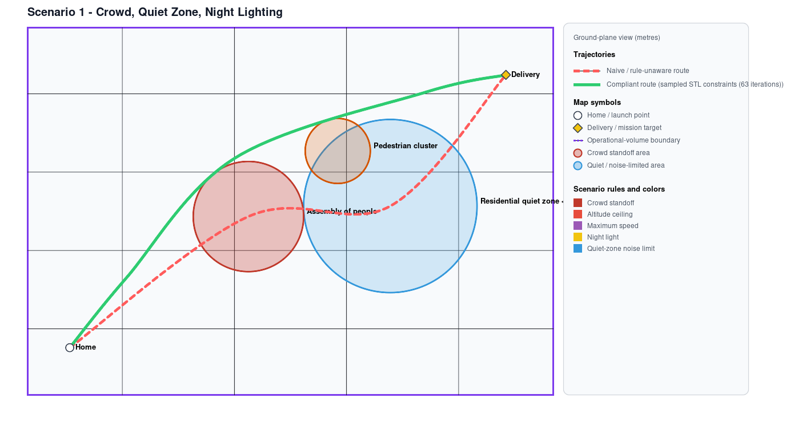
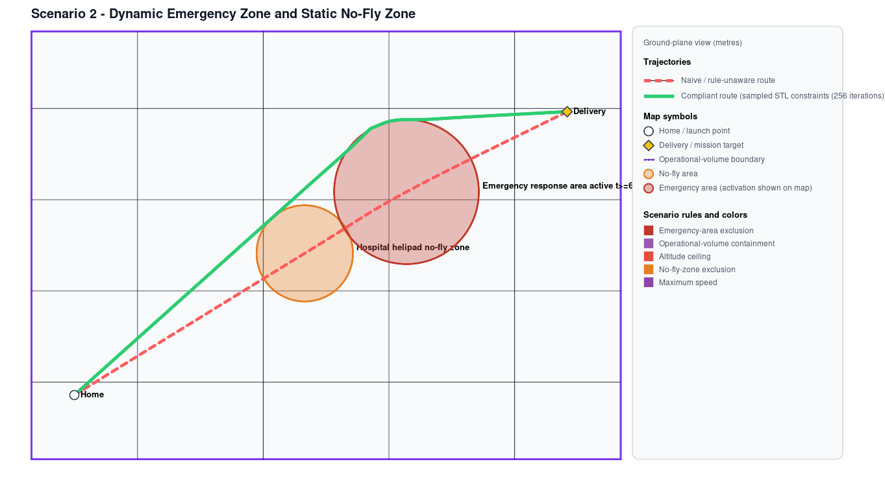
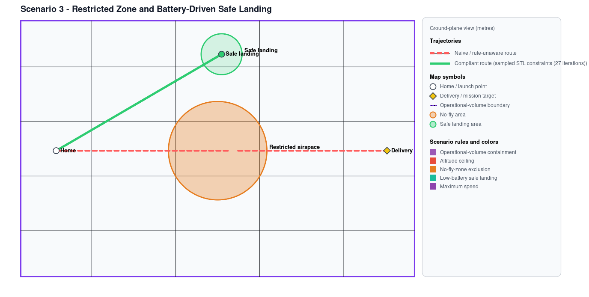

# Formal Rulebook for Autonomous Drone Operations Simulation

This project was developed for the **Advanced Topics in Control (ATIC)** course at **ETH Zürich** by Mamoun Rhmari Tlemcani, Hadrien Legros, Ben Youssef Belkis, and Saad Lahlou.

This repository is a research prototype for planning short drone trajectories that satisfy selected, scenario-defined operational rules. It combines a signed-robustness monitor with a two-stage nonlinear waypoint optimiser and three synthetic case studies.

The full formal rulebook, its legal-source annotations, and the accompanying report are private and are intentionally not included in this repository. The public code retains stable `REQ-*` identifiers and compact scenario abstractions only, so that the examples remain reproducible without presenting the rulebook as a public legal reference.

## Method

A trajectory is a Catmull--Rom spline through a fixed start, a fixed mission goal, and a small set of optimised 3D intermediate waypoints. The planner evaluates 360 equally spaced samples of each candidate trajectory. The monitor computes a signed robustness value for every selected rule at each sample: positive is safe, zero is the boundary, and negative is a violation.

The solver operates in two stages:

1. If the fallback-derived waypoint seed is infeasible, L-BFGS-B minimises a temporary restoration objective on a 90-sample trace:

   ```math
   J_{\mathrm{restore}}(\theta)
   = L(\tau_\theta)
   + \lambda \sum_{r \in \mathcal{R}} \sum_{k=1}^{90}
     \max\!\left(0, -\rho_r(\tau_\theta, t_k)\right)
   ```

   This soft penalty only finds a useful starting point; it is not the safety guarantee.

2. SLSQP then minimises path length subject to hard robustness constraints on the full monitoring grid:

   ```math
   \begin{aligned}
   \min_{\theta}\quad & L(\tau_\theta) \\
   \text{subject to}\quad & \rho_r(\tau_\theta, t_k) \ge \varepsilon_r, \\
   & r \in \mathcal{R}, \qquad k \in \{1, \ldots, 360\}.
   \end{aligned}
   ```

   The default margin is `1e-3` in the rule's native robustness unit. The candidate is independently monitored again and accepted only if all constraints pass; otherwise the fallback route is returned.

This is sampled nonlinear trajectory optimisation. It does not prove continuous-time satisfaction between samples, global optimality, aircraft dynamic feasibility, or forward invariance.

## Included scenarios and results

| Scenario | Selected behaviour | Naive compliance | Constrained compliance |
| --- | --- | ---: | ---: |
| Crowd, quiet zone, night | Route around people and quiet zone; enable night light | 95/360 (26.4%) | 360/360 (100%) |
| Emergency reconfiguration | Avoid a static no-fly zone and a time-activated emergency area | 217/360 (60.3%) | 360/360 (100%) |
| Low-battery abort | Divert to the safe landing site instead of completing delivery | 146/360 (40.6%) | 360/360 (100%) |

<p align="center">
  
</p>
<p align="center">
  
</p>
<p align="center">
  
</p>

The red dashed routes are rule-unaware references; the green routes are accepted constrained solutions.

## Rules represented in the scenarios

The scenarios use simplified monitorable abstractions, not direct legal interpretations:

- crowd stand-off zones;
- horizontal operational-volume containment;
- 120 m altitude ceiling;
- static no-fly and time-activated emergency cylinders;
- 19 m/s speed limit;
- night-light requirement;
- quiet-zone noise proxy; and
- low-battery safe-landing condition.

Zone geometry, timing, thresholds, and all rule selections are scenario data in `scenario/scenarios/`. In particular, crowd zones are conservative vertical-column exclusions, the quiet-zone rule allows either staying outside the zone or meeting its noise limit, and the battery rule is a simplified sampled safe-state condition.

## Run

Python 3.10+ is required.

```bash
python -m pip install -r requirements.txt
python scenario/scenario_simulation.py
```

Run one scenario or create only the static maps:

```bash
python scenario/scenario_simulation.py --scenario crowd_noise_night
python scenario/scenario_simulation.py --only-2d
python scenario/scenario_simulation.py --scenario crowd_noise_night --crowd-buffer 10 --only-2d
```

Interactive HTML outputs are written to `scenario/output/`; static SVG maps are written to `scenario/output_2d/`. Both are generated files and are ignored by Git.

## Repository layout

```text
assets/                         Public 2D outputs used in this README
scenario/
  core.py                       Trajectory generation, monitoring, and optimisation
  scene.py                      Scenario geometry data types and plotting helpers
  plot2d.py                     Static SVG renderer
  scenario_simulation.py        Command-line runner
  scenarios/                    Three synthetic scenario definitions
requirements.txt                Runtime dependencies
```

## Limitations

The examples use synthetic geometry and prescribed context signals. They do not model terrain, obstacles, wind, dynamics. If selected rules are mutually infeasible, this prototype returns its fallback rather than implementing a general lexicographic rule-resolution procedure.
